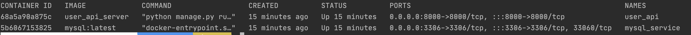

# user_api
login with user api

## 1 스펙
SERVER : Django, Django-rest-framework

DB : Mysql

### 상세 스펙

#### 로그인 
- login JWT token 이용 common/backends.py (BaseAuthentication 상속받음)

#### 인증
- 인증 방식 auth 테이블에 토큰값 저장
- sms 방식 대신 get api 호출하여 토큰값 확인

#### 회원가입
- 토큰 param(auth_number)을 받아야 회원가입가능 (유효시간 5분)

#### api-document 적용
아래의 로컬 구동 후 접속 가능
- http://localhost:8000/swagger/

#### tdd 적용
- python manage.py test

## 2 로컬테스트 환경 구성
.env
- ENV=dev mysql(docker db server)
- ENV=local sqlite

docker-compose를 이용하여 mysql, api-server를 띄울수 있게 구성

#### 로컬에 도커가 설치되어있어야한다.

도커로 띄우기 싫다면
- .env의 ENV=local로 변경
- python manage.py migrate
- python manage.py runserver

## 2-1 환경변수
django-dotenv 외부 라이브러리 이용중

user_api와 하위 경로에 .env파일에 환경변수를 세팅해줘야함

## 2-3 매크로정의 툴
Makefile을 사용하여 명령어 셋업 툴 구성

- @docker-compose up --d db
- @sleep 10
- @docker-compose up --build --d server
- @docker-compose exec server python manage.py migrate
- @docker-compose exec server python manage.py test

### 설명 
도커 DB 실행, 10초대기(mysql이 먼저 켜지게 하기 위함), 도커 서버 빌드 및 실행, 디비 마이그레이트, 테스트코드 실행

## 2-4 로컬 실행
make local 명령어를 통해서 서버 실행

## 3-1 api 기능
api 문서 참조
- http://localhost:8000/swagger/ 

## 4 tdd
api 기능별로 테스트코드 작성
경로 : user/tests file

## 4-1 AuthTest
인증 번호 전송 api를 실행
sms 대신 get방식의 인증번호 확인 api를 통해서
post로 저장한 auth_number와 get api로 가져온 auth_number을 비교

## 4-2 SignUpTest
AuthTest를 상속받음
상속받은 AuthTest api의 auth_number값을 받아와 회원가입 실행

## 4-3 TestWithUser
다른 api의 테스트를 위하여 회원가입 데이터, 인증번호 데이터, 로그인 토큰값
을 세팅해둔 테스트 클래스

## 4-4 LoginTest
TestWithUser를 상속받음
이메일로 로그인, 닉네임으로 로그인, 전화번호로 로그인을 테스트한다.

## 4-5 ProfileTest
TestWithUser를 상속받음
프로필 조회, 비밀번호 변경을 테스트한다.

비밀번호 변경 -> 인증번호를 발송하여 해당 인증번호와 DB값이 일치하면 비밀번호 변경 

